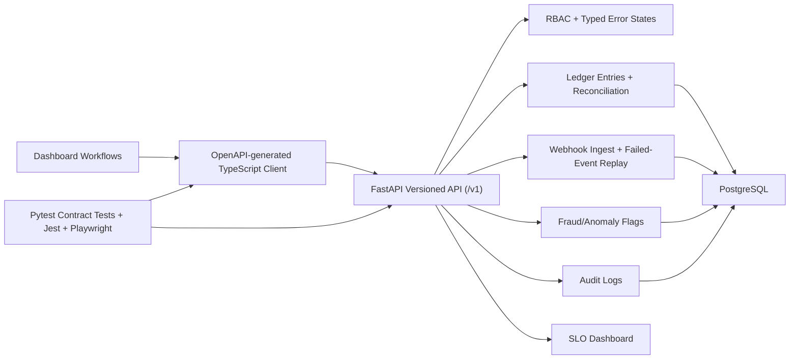

# API Contract & Developer Experience Toolkit

Production-style API standards toolkit built with Python, FastAPI, TypeScript, OpenAPI, and PostgreSQL. It demonstrates versioned API conventions, OpenAPI-generated TypeScript clients, contract tests, schema versioning, deprecation notes, idempotency keys, webhook replay, ledger reconciliation, fraud/anomaly flags, SLO dashboard data, failed-event replay, retry/backoff handling, audit logs, RBAC, Playwright/Jest coverage, and a Dockerized local setup.

## Architecture Diagram



## What Is Included

- Versioned FastAPI endpoints under `/v1` with pagination, filtering, typed error states, RBAC, audit logging, and schema-version headers.
- OpenAPI export at `docs/openapi.json` and generated TypeScript types at `client/src/generated/schema.ts`.
- TypeScript client helpers for idempotent ledger writes, webhook ingest/replay, SLO reads, schema reads, and retry/backoff handling.
- 25 backend contract tests plus Jest unit coverage and Playwright API coverage.
- Docker Compose setup with PostgreSQL seed data for ledger, webhooks, fraud flags, audit logs, and SLO examples.
- Schema-versioning rules, backward-compatible API change examples, deprecation notes, migration examples, benchmark table, and review checklists.

## Quick Start

```bash
make setup
make test
```

Run the API locally with SQLite:

```bash
.venv/bin/python -m uvicorn backend.app.main:app --reload
```

Run the full Dockerized local setup with PostgreSQL:

```bash
docker compose up --build
```

Useful local API calls:

```bash
curl http://127.0.0.1:8000/health
curl -H "X-API-Key: admin-key" http://127.0.0.1:8000/v1/ops/slo-dashboard
curl -H "X-API-Key: admin-key" http://127.0.0.1:8000/v1/ledger/reconciliation
```

Regenerate the OpenAPI contract and TypeScript client:

```bash
make generate-client
```

## API Conventions

- `X-API-Key` enforces RBAC. Built-in roles are `admin`, `analyst`, and `integration`.
- `X-Schema-Version` defaults to `2025-02-01`; `2024-09-01` is supported but deprecated.
- `X-Idempotency-Key` is required for write endpoints and protects against duplicate ledger/webhook writes.
- Pagination uses `page`, `page_size`, `items`, and `meta`.
- Errors use a shared `{ code, message, details, request_id }` shape.
- Deprecated endpoints return `Deprecation`, `Sunset`, and `Link` headers.

## Benchmarks

| Workflow | p50 | p95 | p99 | SLO |
| --- | ---: | ---: | ---: | --- |
| Ledger list with filters | 34ms | 88ms | 111ms | p95 under 120ms |
| Ledger reconciliation | 41ms | 96ms | 118ms | p95 under 120ms |
| Webhook ingest | 29ms | 83ms | 105ms | p95 under 120ms |
| Failed-event replay | 45ms | 94ms | 117ms | p95 under 120ms |

The `/v1/ops/slo-dashboard` endpoint exposes the same p95 API latency target for dashboard consumption.

## Review Checklist

- Contract tests cover new or changed endpoints.
- OpenAPI is regenerated and the TypeScript client compiles.
- Backward-compatible API changes are additive or defaulted.
- Deprecation notes include successor route and sunset date.
- Write endpoints enforce idempotency keys.
- Webhook replay paths are auditable and bounded.
- Ledger reconciliation and fraud/anomaly flags are visible to analyst/admin roles.
- Retry/backoff behavior is covered in client tests.
